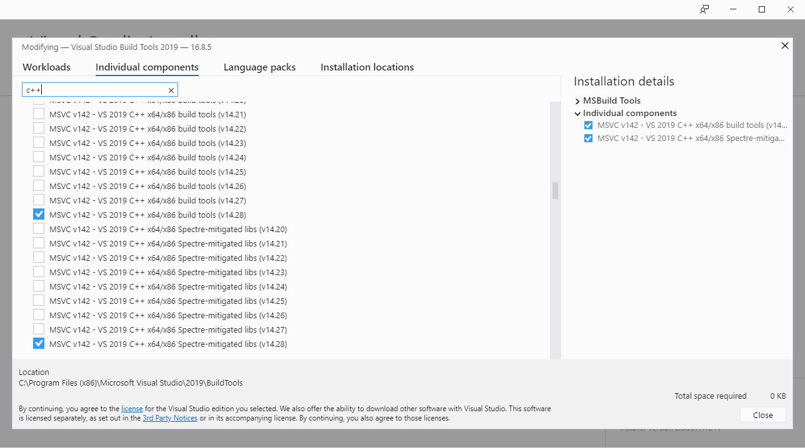
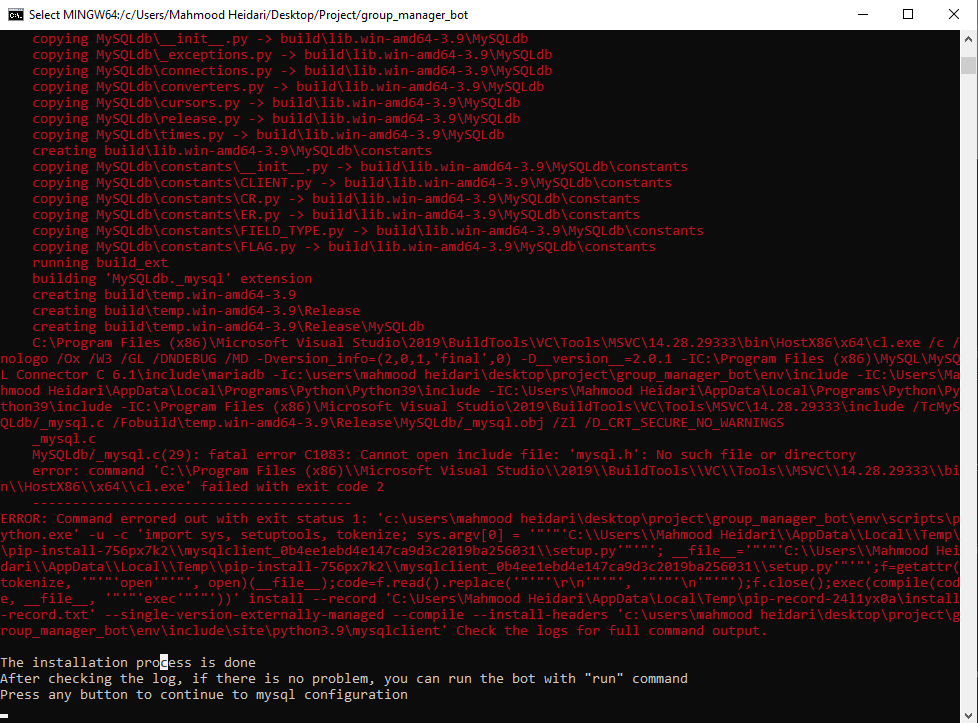

# Getting Started

<p align="center">
    <a href="https://www.python.org/downloads/">
        
    </a>
    <a href="https://pypi.org/project/Django/3.1.6/">
        
    </a>
    <a href="https://pypi.org/project/djangorestframework/3.12.2/">
        
    </a>
    <a href="https://pypi.org/project/Pyrogram/1.1.13/">
        
    </a>
    <a href="https://www.mysql.com/downloads/">
        
    </a>
    <a href="LICENSE">
        
    </a>
</p>

Just move step by step and everything should work so good.

## Installation

Before using the bot, you need to install some dependencies that the project works with them but don't worry, there is an automation shell script for that.\
Dependencies:
1. Python3
2. Python3-pip (pip3)
    * django
    * djangoRestFramework
    * pyrogram
    * mysqlclient
    * wheel
    * tgcrypto
    * json (built-in)
3. Python3-venv (Python Virtual Environment)
4. MySQL

### Linux (Debian and Ubuntu base)

Open up your terminal, Go to the main project directory and just run:
```
source ./commands/deploy
```
And answer the asked configurations on the way of installation.
### Windows (Before Installation)

Install [Git](https://git-scm.com/download/win), [Microsoft Visual C++ 2015](https://www.microsoft.com/en-us/download/details.aspx?id=52685), [Python](https://www.python.org/downloads/), [MySQL](https://dev.mysql.com/downloads/installer/) and Microsoft Visual C++ v14 (read down for installation instructions) individually. (I can't automate that process, sorry)\
⚠️ Note: for installing "Microsoft Visual C++ v14" you need to use [Microsoft C++ Build Tools](https://visualstudio.microsoft.com/visual-cpp-build-tools/). So start Microsoft C++ Build Tools, let it download, get to **Indivisual Components** section and search "C++" and choose down selected item/items or a higher version of that and click install.\

⚠️ Note: If you had any error in down up comming instructions from wheel installation(an error for mysql) like this one picture down below, download highest version of mysqlclient from [here](https://www.lfd.uci.edu/~gohlke/pythonlibs/#mysqlclient) and install it by pip like `pip3 install mysqlclient-1.4.6-cp39-cp39-win_amd64.whl` and you should have no other problems.


### Windows

Open up **command prompt(cmd)** (powershell will **not** work), Go to the main project directory and run:
```
python3 auto.py
.\env\Scripts\activate
python3 auto.py windows
```
And do the asked configurations on the way of installation.

## Configuration

During running the installation automation, the automation will ask you some questions and you just give him the right answer.\
That's it.\
Configurations will generate automat and There are no other configurations to do.

## Usage

Now that all of the top Dependencies should be installed on your system already configurations should be done, if you finished all top installation process successfully, you are ready to run the bot with:
```
python3 main.py
```